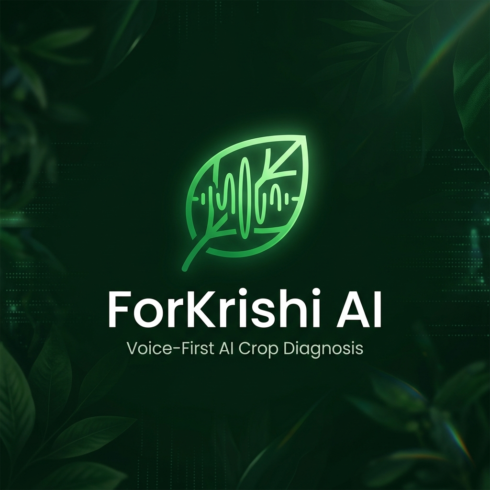
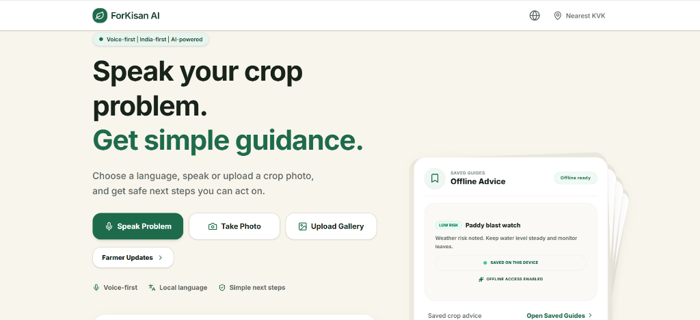
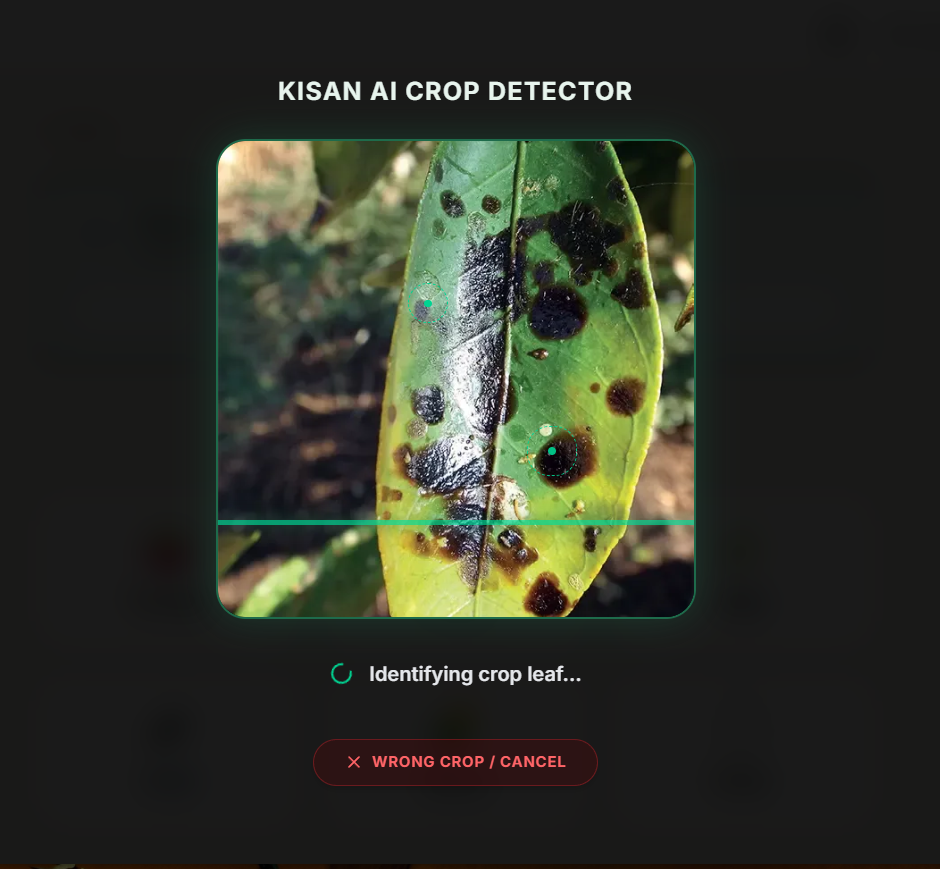
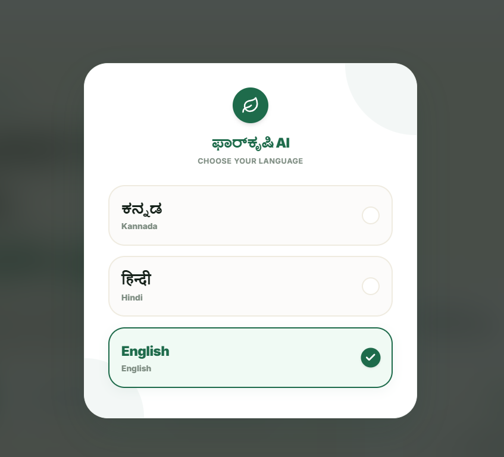
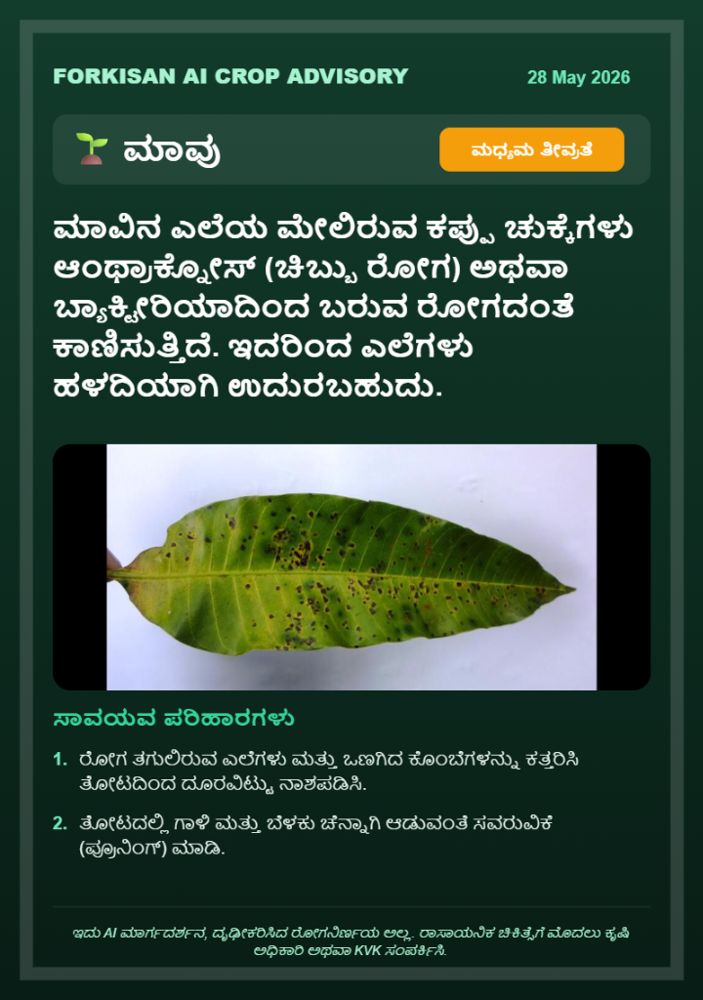

<div align="center">


# 🌱 ForKrishi AI (ForKisan)
### *Voice-First · India-First · AI-Powered Crop Help Assistant*

[](https://nextjs.org/)
[](https://react.dev/)
[](https://ai.google.dev/)
[](https://tailwindcss.com/)

---
</div>

**ForKrishi AI** is a lightweight, mobile-first web app designed for Indian farmers. It simplifies crop disease diagnosis through voice and visual AI inputs, completely localized into native languages (**English, Kannada, and Hindi**).

## ✨ Key Features

*   **🎙️ Voice-First Diagnosis**: Farmers speak crop problems in local languages; Gemini AI transcribes, processes, and diagnoses instantly.
*   **📸 Visual Photo Scanner**: Real-time leaf lesion detection with bounding-box analysis and confidence rating.
*   **🌿 Organic vs. Chemical Advisories**: Split treatment plans featuring a strict *Pesticide Safety Precautions* warning card.
*   **📲 WhatsApp Share Card Engine**: Generates and downloads custom-branded PNG cards on the fly using HTML5 Canvas.
*   **💰 Voice-Query Mandi Prices**: Interactive market boards with voice-search and voice-readout price trends.
*   **📶 Saved Offline Database**: Fully cached localStorage advisor profiles for connectivity-free field access.
*   **🗺️ Expert Support**: Direct local Krishi Vigyan Kendra (KVK) finder to call or navigate to local extension officers.

## 📸 Results & Screenshots

Here are the latest results and interface screenshots showing the premium localized features, scan overlays, and advisory cards:

| Home Screen | Crop Detector & Cancel Button |
| --- | --- |
|  |  |

| Localized Language Selection | Kannada Crop Advisory Card |
| --- | --- |
|  |  |

## 🛠️ Tech Stack

*   **Frontend**: Next.js 15, React 19, TailwindCSS, Framer Motion (`motion/react`)
*   **AI Integration**: Google GenAI SDK (`@google/genai`), Gemini 3.5 Flash Model
*   **Web API**: HTML5 Canvas, Web Speech Synthesis & Speech Recognition API
*   **Caching**: LocalStorage Offline Cache + Service Worker

## 🚀 Getting Started

### Prerequisites
*   Node.js (v18+)
*   NPM

### Installation & Run

1. **Clone the repository**:
   ```bash
   git clone https://github.com/Akash-62/ForKrishi_Ai.git
   cd ForKrishi_Ai
   ```

2. **Install dependencies**:
   ```bash
   npm install
   ```

3. **Configure Environment**:
   Create a `.env` file in the root directory and add your Gemini API Key:
   ```env
   GEMINI_API_KEY="your_api_key_here"
   ```

4. **Launch development server**:
   ```bash
   npm run dev
   ```
   Open [https://for-krishi-ai.vercel.app/](https://for-krishi-ai.vercel.app/) to view the app!
